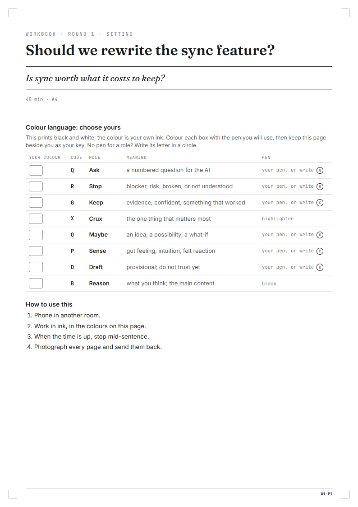
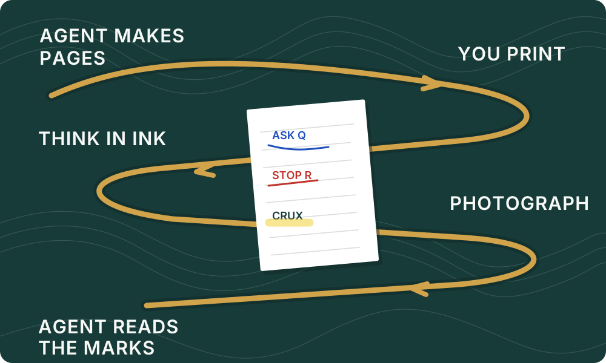

<h1 align="center">
  <picture>
    <source media="(prefers-color-scheme: dark)" srcset=".github/assets/switchback-dark.svg">
    
  </picture>
</h1>

<p align="center"><strong>Step out of the agent loop to think on paper, then come back with a clearer next step.</strong></p>

<p align="center">
  <a href="https://www.npmjs.com/package/@vandermerwed/switchback"></a>
  <a href="https://github.com/vandermerwed/switchback/actions/workflows/ci.yml"></a>
  <a href="LICENSE"></a>
  <a href="https://switchback.pages.dev">Website</a>
</p>

Programmable stationery for AI agents. Your agent makes a few focused pages for the problem in
front of you, adapted to the pens and paper on your desk. You print them, put the phone in
another room, and work them in ink. Then you photograph the pages and the agent reads them back:
it answers the questions you wrote in blue, carries your red objections forward, and turns the
marks on a proof into an action queue.

> **Early preview.** Built and tested with Claude Code; other agents that read
> skills should work too. Expect rough edges, and please report them in
> [issues](https://github.com/vandermerwed/switchback/issues).

<p align="center"></p>

<p align="center"><em>Sitting workbook cover W1-P1, built by the Switchback CLI and ready to print.</em></p>

## The loop

<picture>
  <source media="(max-width: 600px)" srcset=".github/assets/loop-mobile.svg">
  
</picture>

The agent makes the pages; you print them, think in ink away from the screen, photograph them,
and the agent reads the marks back.

## Install

**Claude Code**

```
/plugin marketplace add vandermerwed/switchback
/plugin install switchback@switchback
```

**Codex, opencode, Cursor and other agents that read skills**

```
npx skills add vandermerwed/switchback
```

The skill drives the `switchback` CLI and fetches it with `npx` the first time. To install it
once instead:

```
npm install -g @vandermerwed/switchback
```

You need Node.js 20.12 or later, a printer, a pen and a phone camera. PDFs come from Chrome, Edge
or Chromium; without one, you print the HTML page from any browser.

## Use it

Ask your agent the way you normally would. `/switchback` picks the mode from the request.

| You say | Mode | What happens |
| --- | --- | --- |
| "I can't decide whether to kill the sync feature. Let's work it through on paper." | **workbook** | a few pages in the right style for the job, confirmed in one message, built as a PDF |
| "Print this draft so I can mark it up." | **proof** | numbered paragraphs, wide margins, and a key to what each pen asks the agent to do |
| *You send photos of the marked pages.* | **read** | your questions answered first, notes about the pages kept apart, open objections carried forward |
| "I've got blue, red and green pens and a highlighter." | **desk** | a saved profile, so every page uses the pens you actually have |

To choose the mode yourself, type `/switchback workbook`, `/switchback proof`,
`/switchback read` or `/switchback desk`. If another command already uses `/switchback`, Claude
Code's full name for it is `/switchback:switchback`.

## Workbook styles

| Style | For | Shape |
| --- | --- | --- |
| **Sitting** | decide, diagnose, plan | one session: cover, three to six pages, commit, question queue, return checklist |
| **Series** | remember something over weeks | three rounds: round 2 about a day after round 1, round 3 about three days after round 2, and, if the deadline allows, a fourth about a week after that; each is 20 to 40 minutes and opens with recall before review |
| **Incubation** | create, name, invent | a generating half, a real break, a judging half |
| **Ritual** | the same question, weekly | one identical page each time, so change shows across returns |
| **Proof** | review a document | numbered paragraphs, wide margins; each colour asks the agent for an action |

The CLI enforces each style's shape and explains a violation with the claim and grade behind
the rule.

## The colour language

The printer prints black on white; every meaningful mark is your own ink. Roles are assigned to
the pens you have, in priority order, and a role without a pen becomes a circled letter, so a
black pen and a highlighter is a complete kit. `switchback legend` prints your mapping.

| Role | Meaning | On a proof, the agent… |
| --- | --- | --- |
| Ask (blue) | a numbered question for the agent | answers |
| Stop (red) | wrong, risky, not understood | challenges |
| Keep (green) | good, true, worth more | goes deeper |
| Crux (highlighter) | the one thing that matters | re-centres |
| Maybe (orange) | an idea, a what-if | explores |
| Sense (purple) | a gut feeling | justifies |
| Draft (pencil) | provisional, or an edit written in | applies the edit |

`✕` through a paragraph cuts it; `○` round one locks it.

## Why

Working with agents has turned much of the day into a stream of hand-offs: ask, wait, check,
ask again. There is little room left to sit with one hard problem. Switchback puts friction back
only where the thinking happens: the sitting, the pen, the walk away from the screen, the photo
you have to take to get an answer. That is the motivation. It is not a measured claim that
Switchback makes anyone more productive.

What the pages do rest on is graded. Each claim behind a component or style carries a grade,
from A (robust) to D (practice: a technique people use, with no study behind it), with its
sources and DOIs. `switchback show <id>` prints them. A commit page rests on implementation
intentions (A); a card sort rests on epistemic action (C); a timer rests on timeboxing (D). Weak
evidence is labelled, not hidden. The grading lives in
[`packages/switchback/research/`](packages/switchback/research/).

## Your pages and your privacy

Everything Switchback makes stays in a `switchback/` folder in your working directory: the
specs, the PDFs, your photos and the read-backs. Your saved desk lives in your user config
folder (`switchback profile --path` shows where). To read your handwriting, the agent sends the
photos to the AI model it runs on, as it would any image you share with it. Switchback itself
has no server and collects nothing.

## The CLI

`@vandermerwed/switchback` holds the catalogue (37 components and 11 presets), the styles, the
renderer and the PDF output, plus `proof`, `media` and `legend`. See
[`packages/switchback/README.md`](packages/switchback/README.md).

## Contributing

Bug reports and ideas are welcome as [issues](https://github.com/vandermerwed/switchback/issues).
[`CONTRIBUTING.md`](CONTRIBUTING.md) covers the development setup, and
[`CONTEXT.md`](CONTEXT.md) is the glossary.

## Licence

Apache License 2.0, except the Business Model Canvas and Lean Canvas presets, which are CC BY-SA
3.0. See [`LICENSE`](LICENSE) and [`NOTICE`](NOTICE).
